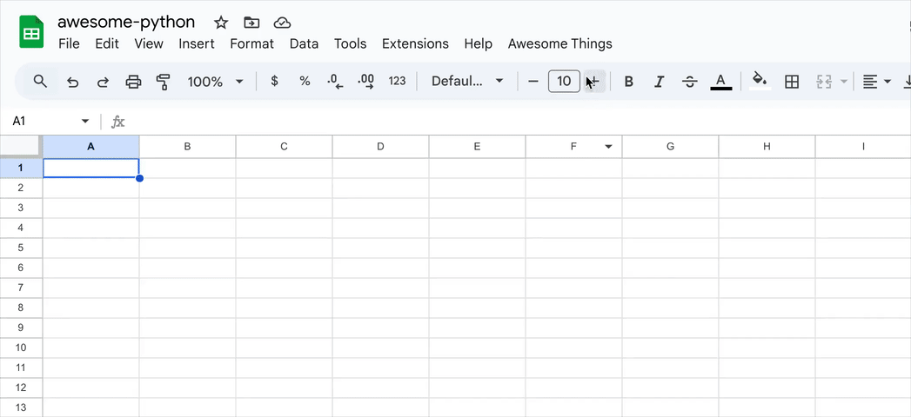

# awesome-things

Have you faced ever with the challenge of choosing the right solutions among many alternatives?

**awesome-things** helps you organize all the options in one table, compare the numbers of stars, open/closed issues/PRs, track the project's dynamic and ultimately make an informed which solution to pick.

The project uses data from awesome-\* repositories, like as [awesome-python](https://github.com/vinta/awesome-python), extracts and parses the data (only from GitHub repositories), and generates a neat spreadsheet table that integrates seamlessly with Google Spreadsheets via Apps Script.



## Requirements

- Google Account
- GitHub Account

## Setup (local usage only)

1. Clone this repository

   ```shell
   git clone https://github.com/roboloop/awesome-things
   ```

2. Install [clasp](https://github.com/google/clasp) and grand access

   ```shell
   npm install -g @google/clasp

   # Log in and grant access to Apps Script functionality
   clasp login
   ```

3. Associate the cloned project with your Google Spreadsheets

   - Enable the Google Apps Script API [here](https://script.google.com/home/usersettings)

   - Create a blank Google Spreadsheets [here](https://docs.google.com/spreadsheets/u/0/create?usp=sheets_web)

   - Go to `Extensions` —> `Apps Script`

   - On the Apps Script page, open `Settings` and copy the Script ID

   - Create a `.clasp.json` file:

     ```shell
     cp .clasp.json.example .clasp.json
     ```

   - Paste the Script ID into the `scriptId` field

4. Set up a GitHub Personal Access Token

   - Get a PAT [here](https://github.com/settings/personal-access-tokens) (no scopes required)

   - Create a `.env.local`

     ```shell
     cp .env .env.local
     ```

   - Add the GitHub token to `.env.local` file

5. _(Optional)_ Integrate [daily-stars-explorer](https://github.com/emanuelef/daily-stars-explorer) to check extended GitHub repository statistics:

   - Add the address to `.env.local` file:

     ```
     VITE_STARS_EXPLORER_URL=127.0.0.1:8080
     ```

   - Run the instance (it retrieves the PAT and address from `.env.local` file):

     ```shell
     docker run --rm --name daily-stars-explorer \
       --env PAT="$(sed -n 's/^VITE_GITHUB_TOKEN=//p' .env.local)" \
       --publish "$(sed -n 's/^VITE_STARS_EXPLORER_URL=//p' .env.local)":8080 \
       ghcr.io/emanuelef/daily-stars-explorer:latest
     ```

6. Deploy the project with following command:

   ```shell
   npm run deploy
   ```

## Usage

1. Refresh the Google Spreadsheet page

2. Load the Table of Contents:

   - In the `Awesome Things` menu, select `Load Table of Contents`

   - Enter the GitHub repository link, e.g., <https://github.com/vinta/awesome-python>

   - The `ToC` sheet will be populated

3. Load the specific thing:

   - Select the cell with the interesting item

   - In the `Awesome Things` menu, select `Load Things`

   - A new sheet will be created and filled with data
